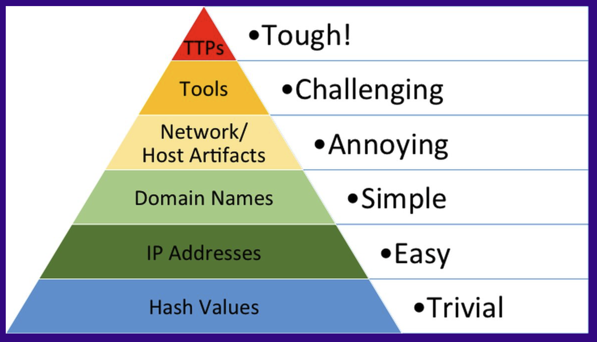

# The Pyramid of Pain and Hunting Focus Areas

## The Hunter's Dilemma

You're staring at millions of log entries, thousands of systems, and hundreds of potential threats. Where do you start? What should you hunt for?

Many new threat hunters reach for what feels concrete: known malicious IP addresses, file hashes from malware reports, domain names tied to command and control servers. These hunts feel productive because they're measurable - "We searched for 500 malicious IPs and found three matches!" But this approach misunderstands what makes threat hunting valuable and what adversaries actually find hard to evade.

The answer lies in a deceptively simple framework. In 2013, David Bianco published the [Pyramid of Pain](https://www.youtube.com/watch?v=3Xrl6ICxKxI), a model that revolutionized how defenders think about detection strategy. Its insight is elegant: adversaries easily change some artifacts (file hashes, IP addresses) but struggle to change others (their operational techniques and procedures). Therefore, effective hunting should focus on what hurts adversaries most to modify - not what's easiest for us to detect.

## Understanding the Pyramid

The Pyramid of Pain arranges adversary artifacts by how much "pain" changing them causes:

At the bottom sit hash values and IP addresses - trivial for adversaries to change. At the top sit tactics, techniques, and procedures (TTPs) - the operational methods adversaries depend on and can't easily abandon. The pyramid's power lies in flipping conventional thinking: instead of hunting for what adversaries leave behind, hunt for what they can't help but do.

**In other words, hunt the behaviours, not the signatures.**

## Level 1: Hash Values - Trivial to Change

At the pyramid's base sit hash values - cryptographic signatures of files, typically malware samples. Security tools use these to identify known malicious files through exact matching.

**Why hashes are trivial to change:** An adversary can recompile malware with minor changes, append random bytes to executables, or use polymorphic techniques that automatically generate variants. Each modification produces a new hash. For sophisticated adversaries, this is essentially free - automated, instantaneous, requiring no operational changes.

**The hash paradox:** Hashes are simultaneously very useful and very limited. When you find an exact hash match, you have high-confidence detection with near-zero false positives. But adversaries easily evade hash-based detection by trivially modifying malware, so hash detection only catches those using unchanged malware - typically less sophisticated actors.

**Implications for hunting:** Should threat hunters search for malicious hashes? Generally no. SIEM rules, EDR systems, and antivirus automatically compare file hashes against threat intelligence feeds at machine speed. Human hunting adds no value to this automated process. Time spent hunting for hashes is time not spent hunting for behavioural patterns that sophisticated adversaries use - exactly those that evaded automated detection.

The exception: hunting for hashes of legitimate tools that adversaries abuse (living-off-the-land binaries), or when specific intelligence indicates particular malware is active but automated tools aren't catching it.

## Level 2: IP Addresses - Easy to Change

IP addresses - the numeric addresses adversaries use for command and control, exfiltration, or attack infrastructure - rank only slightly higher.

**Why IPs are easy to change:** Adversaries maintain pools of compromised servers, cloud hosting, and proxy services. Burning one IP means switching to another from their available pool. Cloud providers offer on-demand IP addresses, compromised IoT devices provide disposable infrastructure, and CDN abuse hides C2 behind legitimate services. Changing IPs requires no malware modification and minimal cost.

**The detection value:** IP-based detection offers more than hash-based because context matters. An IP in your logs provides investigative leads - what else communicated with it? When? What data transferred? Blocking malicious IPs at the network perimeter prevents communication even if an endpoint is compromised, providing defence-in-depth.

**Implications for hunting:** Hunting for specific known malicious IPs has limited value - adversaries change them easily and automated blocking handles this efficiently. However, IP-based analysis is valuable for pattern hunting: destinations with few connections, communications to unusual countries, or beaconing behaviours. Hunt for suspicious IP communication patterns, not specific malicious IPs.

## Level 3: Domain Names - Annoying to Change

Domain names - the human-readable addresses for C2 or phishing - sit higher because changing them creates operational friction.

**Why domains are annoying to change:** Domain changes cause genuine pain. They cost money and require payment methods that leave trails. DNS changes take time to propagate, potentially causing C2 connectivity loss during transition. Adversaries must update malware configuration, inform operators, and coordinate across distributed operations. Newly registered domains often trigger defensive alerts.

**The detection advantage:** Domain-based detection provides longevity - domains often stay registered longer than IPs stay active. Domain patterns reveal adversary tradecraft: character patterns, registration dates, DNS records, and hosting relationships. Domain reputation systems can proactively block newly registered or suspicious domains.

**Implications for hunting:** Like IPs, hunting for specific malicious domains has limited value. But domain analysis reveals patterns - domain generation algorithms (DGAs), registration clustering, or shared hosting infrastructure that exposes broader adversary operations. Hunt for domain behaviors and relationships, not just individual known-bad domains.

## Level 4: Network & Host Artifacts - Challenging to Change

Here we reach the pyramid's middle where things get interesting. Network and host artifacts - URI patterns, certificate characteristics, beaconing intervals, process creation sequences, registry modifications - are tied to how malware actually operates.

**Why these artifacts matter:** Changing them means modifying malware's operational behavior, not just swapping infrastructure. An adversary can easily point malware at a new IP, but changing how it structures C2 callbacks, what registry keys it modifies, or its communication timing requires actual development work.

**Examples of valuable artifacts:**
- URI patterns and user-agent strings that C2 communications use
- Beaconing intervals and jitter patterns
- Process parent-child relationships and command-line patterns
- Registry keys or file paths the malware creates
- Specific HTTP headers or SSL certificate characteristics

**Implications for hunting:** This is where threat hunting begins showing real value. Instead of hunting for specific malicious IPs, hunt for beaconing patterns - regular communication intervals suggesting automated check-ins. Instead of known file hashes, hunt for suspicious process creation chains where legitimate tools spawn each other unexpectedly. You're hunting for how malware behaves, not what it is.

## Level 5: Tools - Difficult to Change

Tools - malware frameworks, lateral movement utilities, credential theft tools - rank even higher because adversaries invest significant effort developing or customizing them.

**Why tools are difficult to abandon:** While theoretically adversaries could drop any tool, in practice they don't do so lightly. Tools represent operational capability they've built, tested, debugged, and trained their operators to use. Metasploit, Cobalt Strike, Mimikatz, custom backdoors - these become integral to adversary operations.

**The tool investment:** Adversaries choose tools based on proven effectiveness, operator familiarity, and operational reliability. Abandoning a tool means replacing tested capabilities with unknown alternatives, retraining operators, and accepting operational risk during transition.

**Implications for hunting:** Tool-focused hunting provides substantial value between abstract TTP hunting and concrete indicator matching. Profile how tools behave - what artifacts they create, what network patterns they exhibit, what system interactions they perform. When you understand tool behavior rather than just signatures, you can detect that tool even after the adversary modifies easily-changed artifacts like hashes or IPs.

## Level 6: TTPs - Most Painful to Change

At the pyramid's apex sit TTPs - tactics, techniques, and procedures - the fundamental operational methods adversaries use to accomplish their mission.

**Understanding TTPs:** A tactic is the adversary's goal - establish C2, move laterally, exfiltrate data. A technique is the specific method - using WMI for lateral movement, leveraging stolen credentials for privilege escalation, employing DNS tunneling for exfiltration. A procedure is the adversary's specific implementation - their exact operational tradecraft.

**Why TTPs cause the most pain:** TTPs are integrated into operational muscle memory, validated through actual compromises, and often dictated by target environment constraints. If an adversary reliably uses WMI because it works in their target's environment and their operators know it well, forcing them to abandon WMI means retraining operators, finding alternative techniques, and validating new procedures under operational conditions. This represents real cost and operational risk.

**The strategic advantage:** When you detect TTPs, you're not just catching one attack - you're forcing adversaries to retool. TTP detection works across different adversary groups using similar techniques. Hunt for WMI-based lateral movement, and you'll detect multiple groups using that technique, regardless of their malware or infrastructure.

**Implications for hunting:** This is where human expertise adds maximum value. Hunt for techniques like lateral movement via WMI, credential dumping with LSASS access, or data staging in unusual directories. Hunt for behavioral patterns that reveal adversary procedures. TTP hunting is proactive - it catches both known and unknown threats using similar methods - and provides understanding of adversary methodology that enables strategic response.

## What This Means for Hunting

The Pyramid of Pain provides clear strategic guidance: **allocate resources inversely to how easily adversaries adapt**.

Automate detection at the pyramid's bottom. Your SIEM, EDR, and threat intelligence feeds should handle hash matching, IP blocking, and domain reputation checking. These systems do it efficiently at scale, with no human intervention needed.

Focus human hunting at the pyramid's top. Hunt for techniques like lateral movement via WMI, credential dumping with LSASS access, or data staging in unusual directories. Hunt for behavioral patterns like beaconing intervals, large internal data transfers, or administrative tool usage from unexpected accounts.

When you start with an indicator - say, a suspicious IP - don't stop there. Ask what technique that indicator represents. What tools might have created it? What procedures does it suggest? What other TTPs might this adversary be using? Transform every indicator investigation into TTP understanding.

Consider hypothesis generation through the pyramid's lens. "Search for known malicious IPs from this month's threat intel" is a poor hypothesis - IPs change easily, and automated tools handle this better. "Investigate whether adversaries are using WMI for lateral movement by examining unusual WMI process creation from non-administrative accounts" is a strong hypothesis - it focuses on a technique adversaries depend on, considers environmental context, and targets behavior that's hard to abandon.

## The Balanced Reality

The Pyramid of Pain isn't suggesting you abandon indicator-based detection entirely. Indicators have value - just not as hunting focus.

Maintain automated indicator detection because it's cheap, fast, and catches unsophisticated threats efficiently. But recognize these are the threats that automated systems should catch. If you're spending human hunting time searching for known indicators, you're optimizing for the wrong adversaries - the ones your automated defenses should already stop.

Invest human expertise where it adds unique value: detecting behaviors and TTPs that require contextual understanding, creative hypothesis generation, and adaptive investigation. This is where human judgment can't be easily replicated by automation.

Create a continuous improvement cycle. When hunting discovers new adversary techniques, feed those discoveries back into automated detection systems. What hunters discover manually should become automated detection, raising the defensive baseline and freeing hunters to discover even newer techniques.

## Common Pitfalls

Don't over-rotate on TTPs to the point of ignoring environmental reality. Administrators legitimately use many "adversary techniques" - PowerShell, WMI, scheduled tasks. TTP hunting without baseline understanding generates overwhelming false positives. Know what normal looks like before hunting for anomalies.

Don't skip the middle levels in rushing toward pure TTP focus. Tool profiling provides substantial practical value between abstract TTP hunting and concrete indicator matching. Understanding how specific tools behave bridges the gap between theory and detection.

Don't confuse TTP detection with attribution. While TTP analysis can help identify adversary groups, that's not the goal. Focus on detecting and disrupting operations regardless of who conducts them. Attribution is a byproduct, not the objective.

## The Core Lesson

The Pyramid of Pain delivers one essential insight: **optimize your defensive strategy around what's expensive for adversaries to change, not what's easy for you to detect**.

This is counterintuitive. It's natural to hunt for concrete, specific things - this hash, that IP, these domains. It feels productive and measurable. But adversaries optimize around the same insight from their offensive perspective: they make artifacts at the pyramid's bottom cheap to change specifically because defenders focus there.

Break that pattern. Hunt for behaviors adversaries can't easily abandon. Detect techniques that are fundamental to their operations. Focus on TTPs that represent real operational investment. When you shift your hunting focus up the pyramid, you force adversaries into genuine adaptation costs - and that's when you start winning the game that matters.

The most valuable question in threat hunting isn't "What indicators should I search for?" It's "What behaviors can adversaries not accomplish their mission without?" Answer that question, and you know exactly where to hunt.